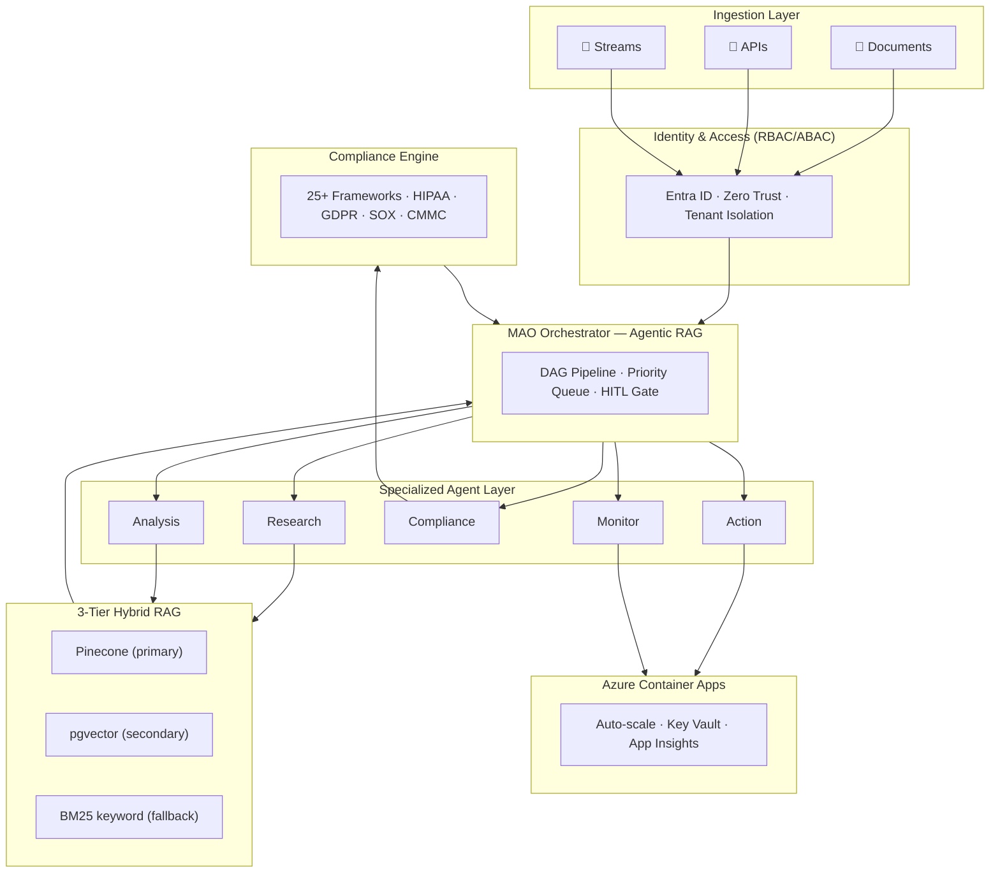
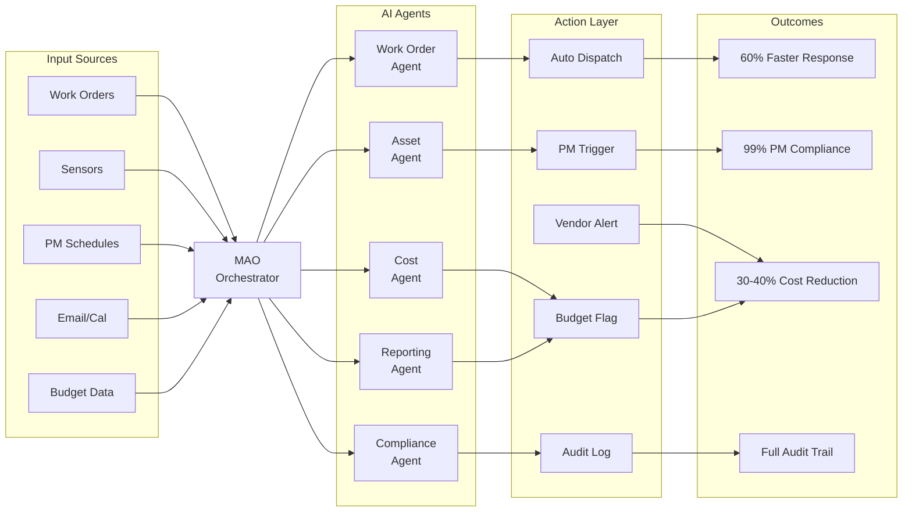
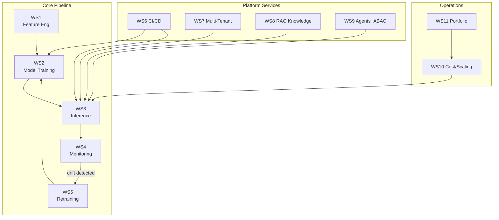
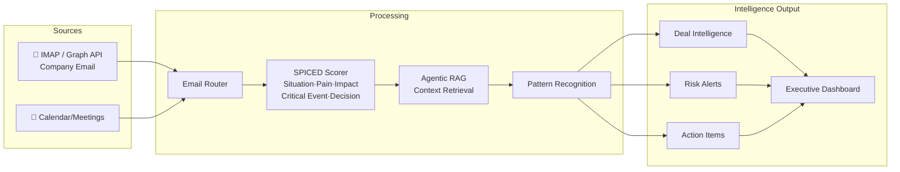
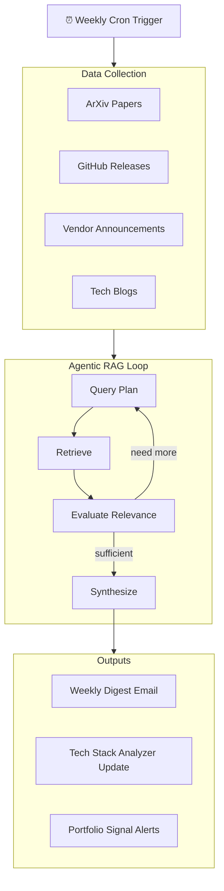

# Bryan Shaw
**Head of AI &nbsp;|&nbsp; AI Platform & Agentic Engineering Leader &nbsp;|&nbsp; CTO**

**Dallas–Fort Worth, TX** &nbsp;|&nbsp; [BryanJShaw@gmail.com](mailto:BryanJShaw@gmail.com) &nbsp;|&nbsp; 817-653-5656  
[LinkedIn](https://www.linkedin.com/in/bryan-shaw-45a23124/) &nbsp;|&nbsp; [GitHub](https://github.com/FlyguyTestRun) &nbsp;|&nbsp; [Inflexis-ai Org](https://github.com/Inflexis-ai) &nbsp;|&nbsp; [inflexis.ai](https://inflexis.ai)

**[1-Page Resume →](./resume/Bryan-Shaw-1Page-AzureAI.md) &nbsp;&nbsp;|&nbsp;&nbsp; [Full Resume →](./resume/Bryan-Shaw-Resume.md) &nbsp;&nbsp;|&nbsp;&nbsp; [Full Portfolio →](./PORTFOLIO.md)**

---

## Summary

Enterprise AI leader with 23+ years of experience architecting and delivering production-grade platforms across infrastructure, cloud, and advanced AI systems. Proven track record of building and scaling multi-agent AI platforms, RAG-based systems, and governed AI solutions in regulated environments, translating enterprise strategy into secure, auditable, and high-performing AI capabilities that drive measurable business outcomes.

Brings a unique combination of executive leadership, product ownership, and hands-on engineering, having led cross-functional teams of up to 30 and partnered with large enterprises and national firms to design and deploy mission-critical systems under strict security, compliance, and operational constraints. Deep expertise across GenAI, agentic architectures, AI governance, and cloud-native platforms (Azure, AWS, GCP), with a strong focus on scalable architecture, DevSecOps-aligned delivery, and Infrastructure-as-Code patterns.

Recognized for delivering enterprise AI platforms under compressed timelines while maintaining governance, model accountability, and operational excellence — and for aligning technical strategy with business priorities through clear communication, risk-aware decision-making, and outcome-driven execution.

---

## Executive Impact

- Delivered enterprise AI platforms across federal, cybersecurity, education, retail, and industrial sectors — **13 distinct builds across 6 industry verticals**
- Reduced implementation timelines from **6–12 months to 4–12 weeks** via reusable, pre-governed architecture patterns
- Drove **30–50% operational efficiency gains** and **60–70% faster time-to-value** across client engagements
- Trusted advisor to C-suite, legal, and business leaders for AI strategy and execution
- Led global, cross-functional teams of up to **30 engineers and architects**
- Built and operationalized multi-tenant AI platforms supporting regulated enterprise clients

---

## Core Capabilities

| | |
|---|---|
| Enterprise AI Strategy & Platform Execution | Agentic AI & Multi-Agent Orchestration |
| Generative AI, RAG & Knowledge Systems | AI Governance, Model Risk & Compliance |
| AI/ML Platform Engineering (Azure, AWS, GCP) | Infrastructure Engineering, IaC & DevSecOps |
| Zero-Trust Security, IAM (RBAC/ABAC) | Human-in-the-Loop AI Systems |
| AI Observability, Evaluation & Optimization | Product Architecture & Commercialization |

---

## Platform Architecture — Visual Overview

### AIXaaS™ — Multi-Agent Orchestration Platform (10-Layer)

---

### Enterprise Facilities Management AI — Corrigo/BNSF Campus (5-Layer MAO DAG)

---

### Inflexis Enterprise MLOps Platform — 11-Workstream Architecture

---

### Business Communication Intelligence Platform

---

### AI Intel — Weekly Agentic RAG Pipeline

---

## Professional Experience

### CTO & Founding Partner — Inflexis Technologies
**Dallas–Fort Worth, TX &nbsp;|&nbsp; June 2024 – Present**

Lead architecture, engineering, and enterprise delivery of AIXaaS™ — a multi-tenant AI orchestration platform serving regulated industries across federal, cybersecurity, industrial, education, food service, and enterprise verticals.

**AI Platform Leadership & Strategy**
- Defined and executed enterprise AI platform roadmap spanning agentic workflows, governance, and scalable deployment models
- Led transition from R&D concept → production platform → multi-client enterprise adoption across six simultaneous engagements
- Partnered with executive stakeholders to align AI initiatives with business outcomes, compliance, and operational priorities

**Platform Architecture, Infrastructure & Engineering**
- Architected and deployed a 10-layer multi-agent AI platform (ingestion, retrieval, orchestration, compliance, observability)
- Designed and delivered production-grade AI infrastructure across Azure and AWS — containerized services, API-driven orchestration, modular deployment
- Implemented DevSecOps-aligned delivery models and IaC patterns for repeatable, secure platform deployment
- Implemented identity-aware access controls (IAM/RBAC/ABAC), tenant isolation, and zero-trust architecture for regulated systems
- Established platform-level observability, cost-aware routing, and performance optimization capabilities

**AI Systems, Delivery & Model Lifecycle**
- Built end-to-end RAG pipelines with hybrid retrieval, reranking, grounding, and citation validation
- Developed multi-agent orchestration systems with governed execution and human-in-the-loop controls
- Implemented durable workflows (pause/resume) for regulated process enforcement
- Established model lifecycle practices: evaluation pipelines, monitoring, performance tracking, controlled production deployment
- Built deterministic compliance engine across 25+ regulatory frameworks (HIPAA, GDPR, SOX, CMMC, FERPA, FedRAMP, DORA, PCI-DSS)
- Designed secure deployment models including air-gapped environments for high-security regulated use cases

**Representative Engagements** *(client names withheld per confidentiality agreements)*
- **Enterprise Cybersecurity Platform** — RAG-based threat intelligence system with full audit trail and access control
- **Government AI Workflow Platform** — FAR/DFARS-aligned contract intelligence with human-in-the-loop approval workflows
- **Industrial Safety AI System** — Real-time anomaly detection with air-gapped deployment and hardware IP protection
- **Enterprise Facilities Management** — Multi-agent orchestration over CMMS platform for Fortune-class rail and commercial client
- **Retail AI Platform** — Inventory forecasting, competitive pricing intelligence, and POS integration across locations

> [GitHub Org](https://github.com/Inflexis-ai) &nbsp;·&nbsp; [Full Portfolio →](./PORTFOLIO.md)

---

### Principal Systems Architect & Consultant — Trial IT Services, LLC
**Dallas, TX &nbsp;|&nbsp; June 2013 – June 2024**

Owned architecture and delivery of enterprise infrastructure, cloud, and security systems across regulated industries for 11 years. Served national law firms and enterprise clients across legal, construction, and professional services.

- Designed hybrid cloud architectures across Azure, AWS, GCP, and on-prem supporting scalable, secure enterprise systems
- Built production-grade infrastructure with high availability, zero-trust security, and operational resilience
- Implemented IAM policies, DevSecOps-aligned deployment pipelines, and endpoint controls aligned to regulated data protection requirements
- Developed Python and PowerShell automation frameworks to standardize deployments and reduce manual overhead
- Served as primary technical advisor to executive stakeholders; owned end-to-end delivery across architecture, implementation, infrastructure, security, and support

---

### IT Systems Lead — E&F Legal Production
**Dallas–Fort Worth Metroplex &nbsp;|&nbsp; 2008 – 2013**

- Built high-performance infrastructure for trial-critical environments under live operational timelines
- Developed data analysis and workflow automation systems, reducing preparation time by up to 90%
- Delivered real-time systems under high-pressure, mission-critical conditions

---

## Technical Expertise

| Category | Technologies |
|----------|--------------|
| **AI & Agentic Systems** | Multi-agent orchestration, DAG pipelines, autonomous workflows, RAG (ingestion, embeddings, retrieval, reranking), human-in-the-loop, LLM orchestration, prompt engineering |
| **Cloud & Platform** | Azure (Container Apps, Entra ID, Key Vault, App Insights, Azure SQL) · AWS (Bedrock, Lambda, Step Functions, S3, ECS/EKS) · GCP · Docker |
| **Security & Governance** | IAM (RBAC/ABAC), Zero Trust, AI compliance (HIPAA, GDPR, SOX, CMMC, PCI-DSS, FedRAMP), observability, evaluation pipelines, air-gapped deployment |
| **Development & DevOps** | Python (FastAPI, async), REST APIs, CI/CD (GitHub Actions), DevSecOps, infrastructure automation, PowerShell |
| **Data & Retrieval** | Pinecone, Qdrant, pgvector, OpenSearch, Azure AI Search, hybrid retrieval, semantic caching, knowledge architecture |

---

## Education

**Engineering & Business** &nbsp;|&nbsp; University of Texas at Arlington &nbsp;|&nbsp; December 2010

---

*[Full Resume →](./resume/Bryan-Shaw-Resume.md) &nbsp;&nbsp;|&nbsp;&nbsp; [1-Page Resume →](./resume/Bryan-Shaw-1Page-AzureAI.md) &nbsp;&nbsp;|&nbsp;&nbsp; [Full Portfolio →](./PORTFOLIO.md) &nbsp;&nbsp;|&nbsp;&nbsp; [inflexis.ai](https://inflexis.ai)*
