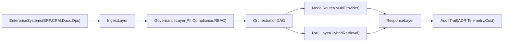

# AIXaaS Executive Architecture

This document explains the AIXaaS operating model in business and technical terms for executive review.

## Executive View

AIXaaS acts as a governed intelligence layer between enterprise systems and AI models. The goal is to deliver reliable outcomes with full control over quality, cost, and compliance.

## Layer Responsibilities

- **Ingest Layer:** normalizes source data from documents, APIs, and operational systems.
- **Governance Layer:** enforces policy checks (PII/compliance/RBAC) before agent execution.
- **Orchestration DAG:** coordinates deterministic and agentic steps with explicit handoffs.
- **Model Router:** selects providers by task fit, quality threshold, and cost profile.
- **RAG Layer:** hybrid retrieval and grounding for reliable, source-attributed responses.
- **Audit Trail:** captures decisions, cost, and operational telemetry for accountability.

## Why This Is Platform-Agnostic

- Model providers are abstracted behind routing policy, not hardcoded into workflows.
- Retrieval and orchestration interfaces are decoupled from specific vector and LLM vendors.
- Governance policies operate independently of model choice.
- Deployment can run cloud-native or constrained/offline patterns for regulated environments.

## Evidence Sources

- Team positioning: `team-workspace/docs/strategy/AI-OS-POSITIONING.md`
- Platform overview: `team-workspace/docs/guides/PLATFORM-OVERVIEW.md`
- Organization references: [Inflexis-ai](https://github.com/Inflexis-ai)
