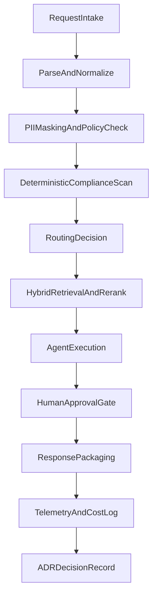

# MAO Orchestration DAG

This view focuses on the operational flow of a governed multi-agent request lifecycle.

## Request Lifecycle

## Control Objectives Per Stage

- **Parse and normalize:** standard input shape for repeatable processing.
- **PII and policy checks:** shift compliance left to reduce downstream risk.
- **Routing decision:** optimize cost/quality without changing user workflow.
- **Retrieval and rerank:** ground responses in governed enterprise context.
- **Human gate:** keep high-risk actions under supervised control.
- **Telemetry and ADR:** preserve complete traceability for legal, security, and operations.

## Practical Benefits

- Reduces ad hoc AI behavior by enforcing explicit stage boundaries.
- Supports regulated workloads with deterministic controls before probabilistic model steps.
- Makes optimization measurable through traceable latency, cost, and quality signals.

## Related Docs

- `portfolio/architecture/AIXaaS-Executive-Architecture.md`
- `portfolio/case-studies/README.md`
